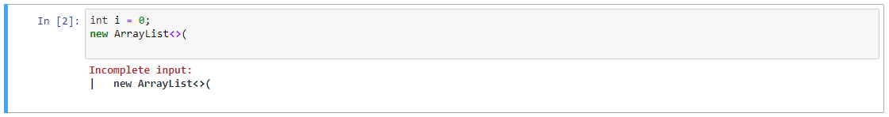
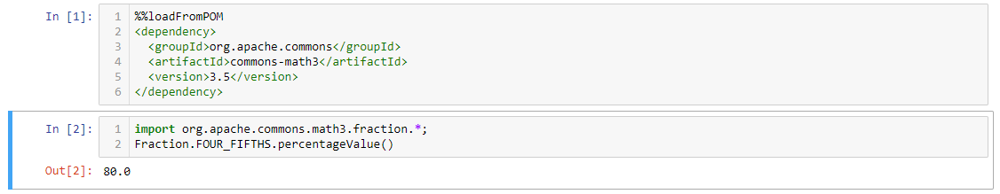
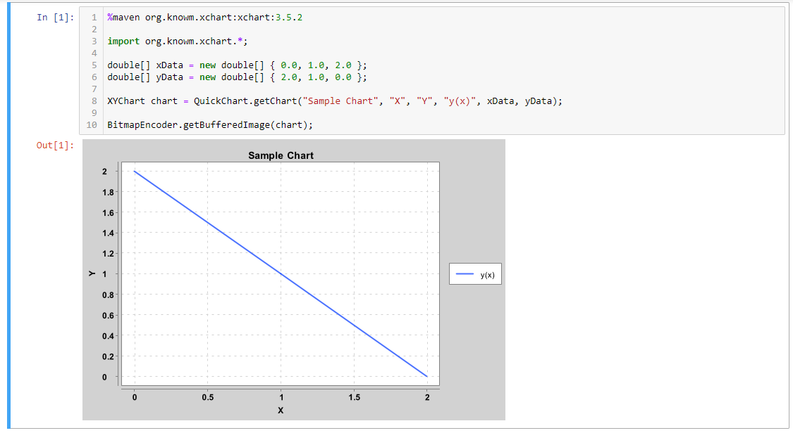

## 安装IJava

1、下载文件 https://github.com/SpencerPark/IJava/releases/download/v1.3.0/ijava-1.3.0.zip

2、解压，进入ijava-1.3.0目录

3、运行 `python3 [install.py](<http://install.py/>) --sys-prefix` 以安装ijava

4、运行 `jupyter kernelspec list`查看是否安装成功：

```json
$ jupyter kernelspec list
Available kernels:
  python3   /Users/chenxilin/Install/anaconda3/share/jupyter/kernels/python3
  java      /Users/chenxilin/Install/anaconda3/share/jupyter/kernels/java
```

5、启动ijava（以下3种方式均可启动ijava）

1. 终端运行 `jupyter console --kernel=java` 来启动ijava
2. 终端运行 `jupyter notebook` ，自动跳转到浏览器，然后New File → 时间和日期.Java时间处理
3. 安装并打开nteract  https://nteract.io/，File → New → 时间和日期.Java时间处理

## 支持的功能

- 执行代码

  

- 自动补全`TAB`

  

- 代码提示 (在jupyter notebok中按`Shift-TAB` ).

  

- 颜色标记, 展示错误信息

  

  

  

- 运行时添加Maven依赖 (See also [magics.md](https://github.com/SpencerPark/IJava/blob/master/docs/magics.md) and [Try the example](https://mybinder.org/v2/gh/SpencerPark/ijava-binder/master?urlpath=lab/tree/home/jovyan/3rdPartyDependency.ipynb) ).

  

- 丰富的输出形式 (See also [display.md](https://github.com/SpencerPark/IJava/blob/master/docs/display.md) and [maven magic](https://github.com/SpencerPark/IJava/blob/master/docs/magics.md#addmavendependencies)). Chart library in the demo photo is [XChart](https://github.com/knowm/XChart) with the sample code taken from their README. ([Try the example](https://mybinder.org/v2/gh/SpencerPark/ijava-binder/master?urlpath=lab/tree/home/jovyan/3rdPartyDependency.ipynb) )

  

- `eval` 方法. (See also [kernel.md](https://github.com/SpencerPark/IJava/blob/master/docs/kernel.md)) **Note: the signature is `Object eval(String) throws Exception`.** This evaluates the expression (a cell) in the user scope and returns the actual evaluation result instead of a serialized one.

  

- 计算运行时间

  

## java版本≥9

Hello Frank,

There are 2 options:

1. Edit the `kernel.json`.

    - Execute `jupyter kernelspec list` to find the install directory of the kernel.

        ```bash
        Available kernels:
          java           C:\\Users\\Spencer\\.ipython\\kernels\\java
         ...
        ```

    - In that directory find `kernel.json` and change `argv`. The `kernel.json` is somewhat like a configuration file that tells jupyter how to start the kernel. The `argv` is simply a command to execute. **NOTE:** use `/` or when using `\\` you must escape them in JSON by writing `\\\\` instead.

        ```bash
        {
            "argv": [
        -        "java",
        +       "C:/absolute/path/to/jdk-9/bin/java"
                "-jar",
                "C:/Users/Spencer/.ipython/kernels/java/ijava-1.0.6-SNAPSHOT.jar",
                "{connection_file}"
            ],
            ...
        }
        ```

2. Add java 9 temporarily to your path before starting the notebook.

    - Like mentioned above the kernel just executes the `java` command to start up the kernel. This means that we can stick the more recent java version at the front of your path.

    - `set PATH=C:\\absolute\\path\\to\\jdk-9\\bin\\;%PATH%` will do this.

        - As a side note I have some variables `JAVA7_HOME`, `JAVA8_HOME`, `JAVA9_HOME` to simplify this switch. Then I use `set PATH=%JAVA9_HOME%\\bin\\;%PATH%` to use a certain version.

    - Then when using `where java` it may give multiple paths but the one at the top of the list should be java 9.

    - Finally launch the notebook with this new path and you should be good to go. Putting everything together

        ```bash
        set PATH=%JAVA9_HOME%\\bin\\;%PATH% && jupyter notebook
        ```

Please let me know how things go!